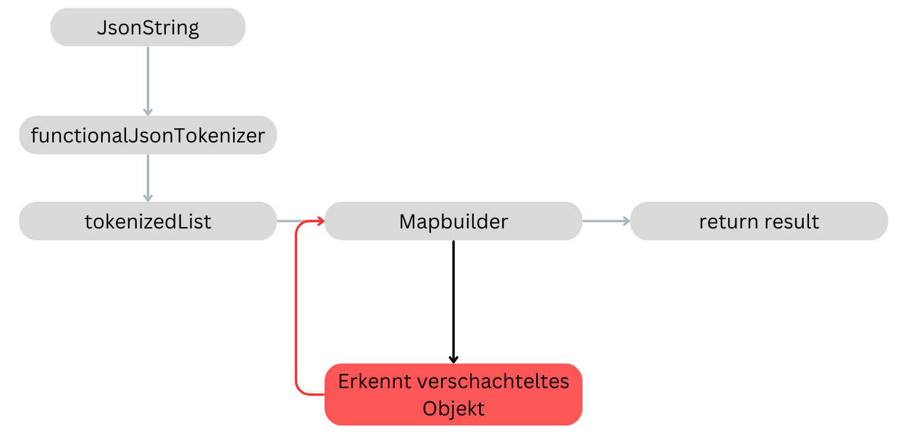

## sbt project compiled with Scala 3

### Usage

This is a normal sbt project. You can compile code with `sbt compile`, run it with `sbt run`, and `sbt console` will start a Scala 3 REPL.

For more information on the sbt-dotty plugin, see the
[scala3-example-project](https://github.com/scala/scala3-example-project/blob/main/README.md).

# Functional JSON Parser
## Zweck
Zur Illustrierung der Unterschiede zwischen dem imperativem- und funktionalem-Paradigma der Programmierung habe ich einen JSON-Parser in Scala - unter ausschließlicher Verwendung von funktionalen Programmierkonzepten - erstellt. Dies wurde dann in meiner Bachelorarbeit "Einsatzgebiete Funktionaler Programmiersprachen" genutzt. 

## Scala (Scalable Language)
Scala ist eine multiparadigma Programmiersprache. In Scala ist es möglich sowohl funktional als auch imperativ zu programmieren. Des weiteren ist die Auswertung von Tail Recursive Calls Speichereffezienter durch die Deklaration der tailrec Annotation, sodass der Compiler darüber informiert wird, dass der Stackframe des aktuellen durchlaufs, nach Ermittlung des Ergebnisses wiederverwendet werden soll. 

## Funktionsweise (Diagramm der Hauptfunktionen. Helferfunktionen werden nicht dargestellt.)

